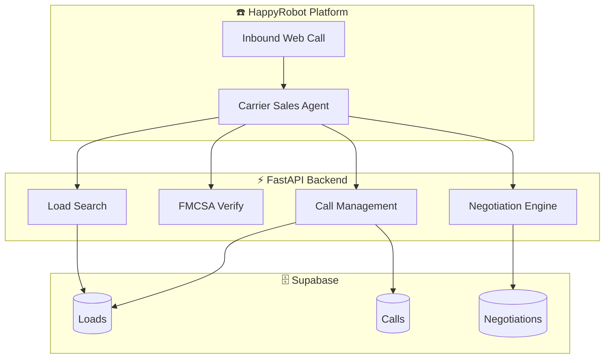
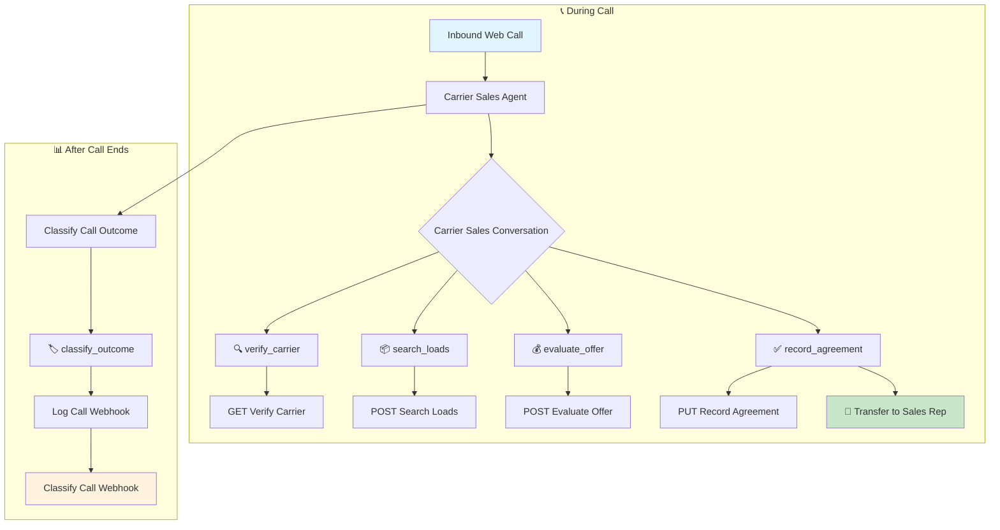
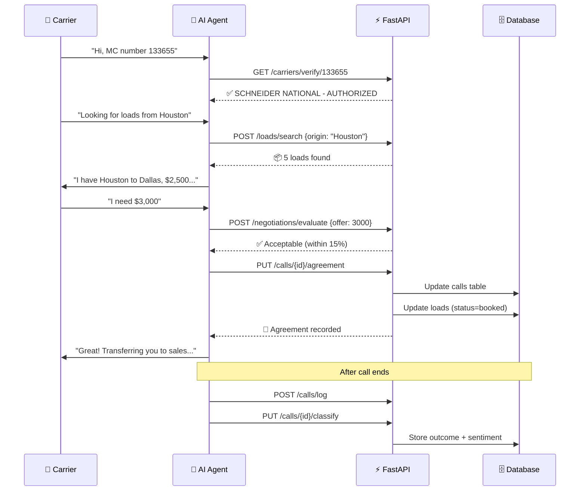
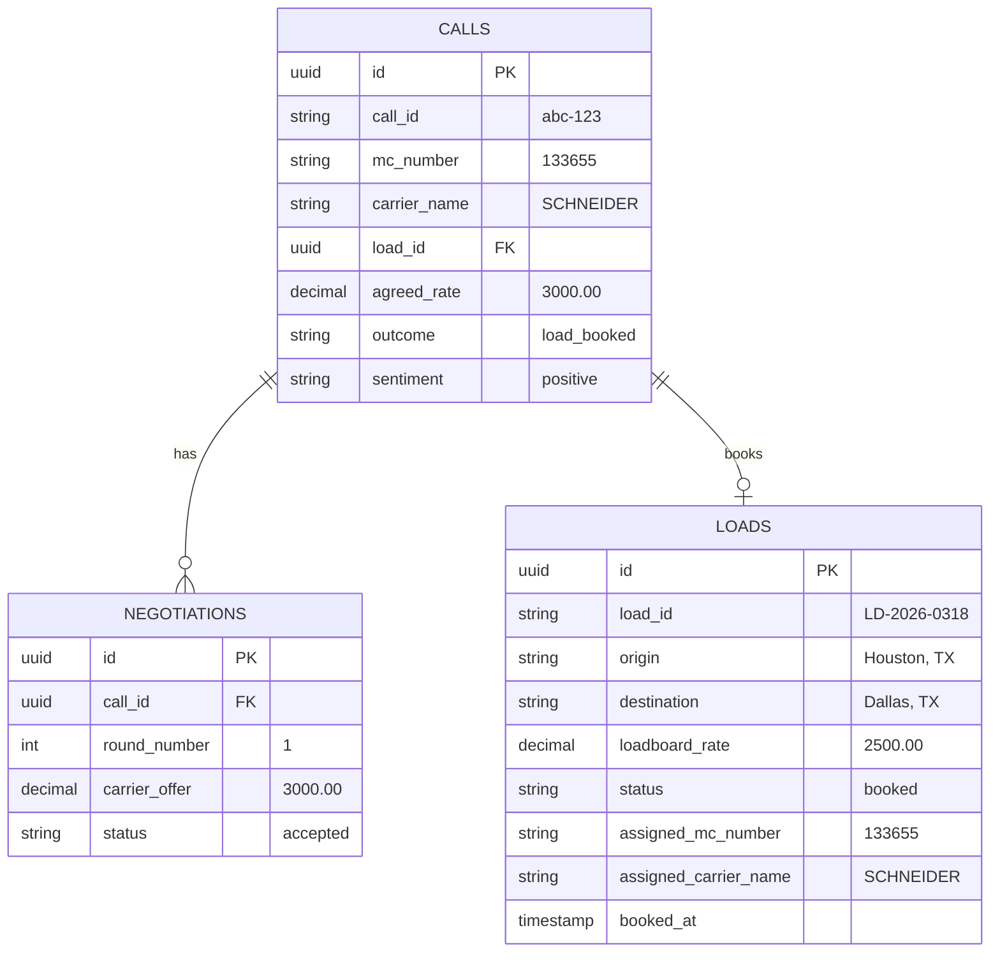
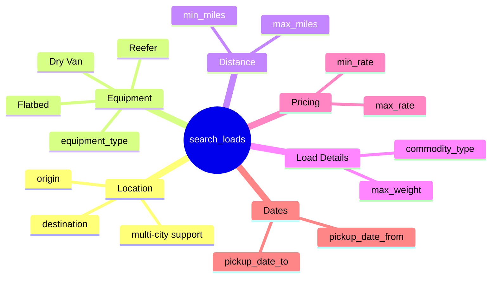
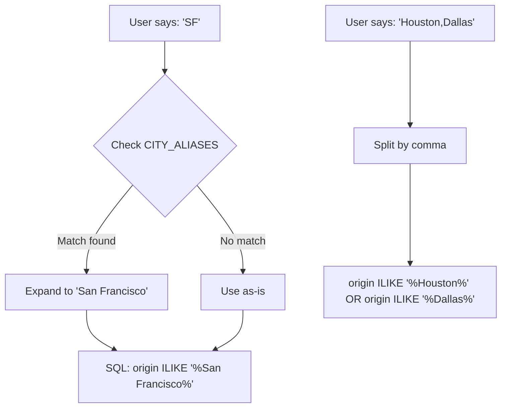
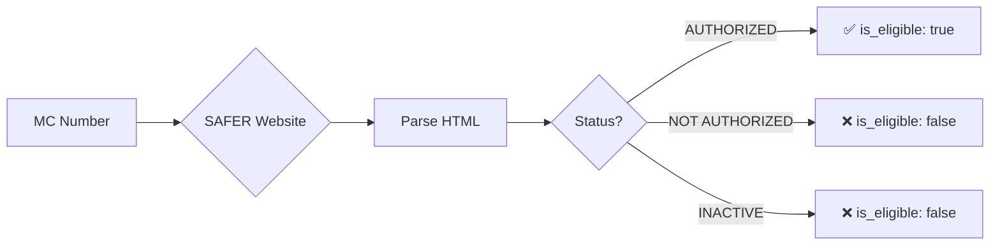
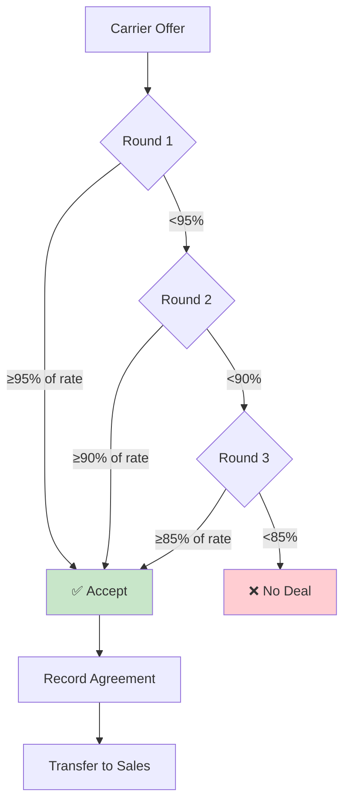
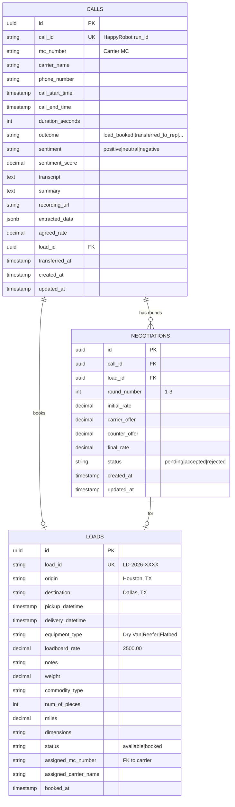
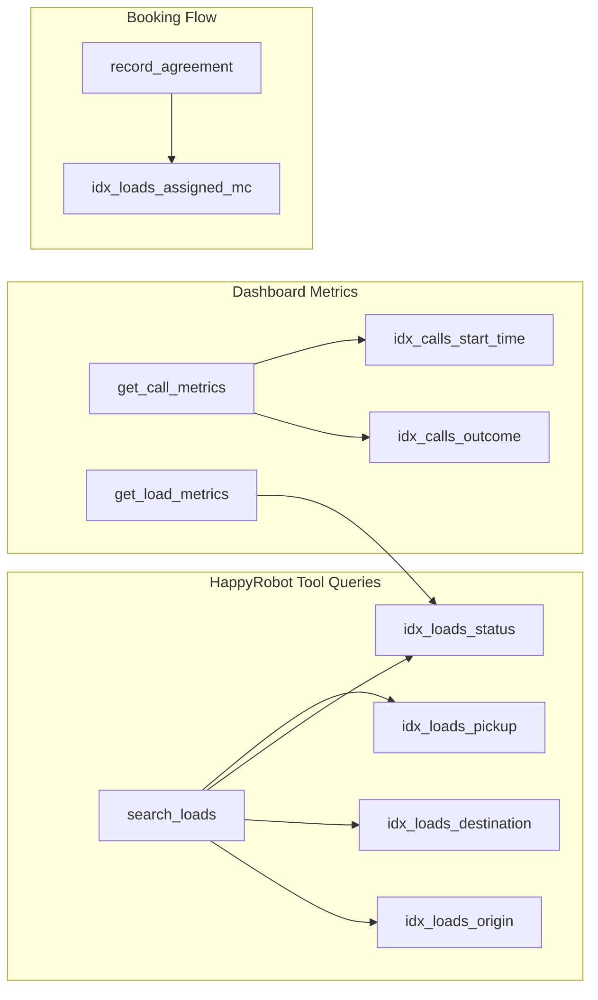

# Happy Robot - Inbound Carrier Sales Automation

AI-powered system for automating inbound carrier calls for freight brokerage load sales.

## Overview

This system handles inbound calls from carriers looking to book loads:
- **Carrier Verification** - Validates carriers via FMCSA SAFER system (live lookup)
- **Load Matching** - Smart search with fuzzy matching and multi-city support
- **Price Negotiation** - Handles up to 3 rounds of negotiation automatically
- **Call Transfer** - Routes agreed deals to sales representatives
- **Call Logging** - Stores all call data and outcomes

## Architecture



## HappyRobot Workflow

The AI agent workflow handles the complete call lifecycle:



## Tools Available to AI Agent

| Tool | Webhook | Purpose |
|------|---------|---------|
| `verify_carrier` | GET `/carriers/verify/{mc}` | Check if carrier is FMCSA authorized |
| `search_loads` | POST `/loads/search` | Find loads matching carrier's criteria |
| `evaluate_offer` | POST `/negotiations/evaluate` | Check if carrier's price offer is acceptable |
| `record_agreement` | PUT `/calls/{id}/agreement` | Lock in deal, book load, prepare transfer |
| `classify_outcome` | PUT `/calls/{id}/classify` | Tag call with outcome and sentiment |

## Data Flow



## Database After Successful Deal



## API Endpoints

### Base URL
**Production:** `https://happyrobot-production-03c4.up.railway.app`

**Dashboard:** `https://happyrobot-production-03c4.up.railway.app/` (same URL, serves dashboard)

### Authentication
All endpoints require header: `X-API-Key: hr-carrier-sales-2024`

### Endpoints

| Endpoint | Method | Description |
|----------|--------|-------------|
| `/health` | GET | Health check |
| `/carriers/verify/{mc}` | GET | Verify carrier by MC number (live FMCSA lookup) |
| `/loads/search` | POST | Search loads with flexible filters |
| `/loads/{id}` | GET | Get specific load details |
| `/loads/booked` | GET | List all booked loads with carriers |
| `/negotiations/evaluate` | POST | Evaluate carrier counter-offer |
| `/calls/log` | POST | Log/update call record |
| `/calls/{id}/classify` | PUT | Classify call outcome/sentiment |
| `/calls/{id}/agreement` | PUT | Record agreed price + book load |

## Search Features

### Available Filters



| Parameter | Type | Example | Description |
|-----------|------|---------|-------------|
| `origin` | string | `"Houston"` or `"SF,LA,Phoenix"` | Origin city (supports multiple, comma-separated) |
| `destination` | string | `"Dallas"` or `"NYC,Boston"` | Destination (supports multiple) |
| `equipment_type` | string | `"Dry Van"` | Equipment type |
| `max_miles` | number | `500` | Maximum trip distance |
| `min_miles` | number | `100` | Minimum trip distance |
| `max_weight` | number | `40000` | Maximum load weight |
| `commodity_type` | string | `"produce"` | Commodity type (partial match) |
| `min_rate` | number | `1000` | Minimum rate |
| `max_rate` | number | `5000` | Maximum rate |
| `limit` | number | `10` | Max results (default 10, max 50) |

### Fuzzy City Matching

The search API implements flexible city matching to handle natural conversation:



#### Alias Dictionary

| Input | Expands To | Reason |
|-------|------------|--------|
| `SF` | San Francisco | Common abbreviation |
| `LA` | Los Angeles | Common abbreviation |
| `NYC` | New York | Airport code style |
| `DFW` | Dallas | Airport code |
| `ATL` | Atlanta | Airport code |
| `CHI` | Chicago | Common abbreviation |
| `HTX` / `HOU` | Houston | Airport codes |
| `NOLA` | New Orleans | Common nickname |
| `VEGAS` | Las Vegas | Colloquial |
| `PHILLY` | Philadelphia | Nickname |
| `INDY` | Indianapolis | Nickname |
| `BMORE` | Baltimore | Nickname |
| `CALI` | California | State abbreviation |

#### Implementation

```python
CITY_ALIASES = {
    "sf": "San Francisco", "la": "Los Angeles", 
    "nyc": "New York", "dfw": "Dallas", ...
}

def expand_city_alias(city: str) -> str:
    return CITY_ALIASES.get(city.lower().strip(), city)

# In search_loads:
if origin:
    cities = [expand_city_alias(c.strip()) for c in origin.split(",")]
    # Build OR query for each city
```

#### Multi-City Search

Carriers often say "I'm near Houston, Dallas, or Austin" - the API handles this:

```json
{"origin": "Houston,Dallas,Austin", "equipment_type": "Dry Van"}
```

Generates SQL:
```sql
WHERE (origin ILIKE '%Houston%' OR origin ILIKE '%Dallas%' OR origin ILIKE '%Austin%')
  AND equipment_type = 'Dry Van'
  AND status = 'available'
```

### Example Searches

```bash
# Multiple origins (carrier near Houston)
{"origin": "Houston,Dallas,Austin,San Antonio", "equipment_type": "Dry Van"}

# Short haul only
{"origin": "SF", "max_miles": 300}

# Specific commodity
{"commodity_type": "produce", "equipment_type": "Reefer"}

# Rate range
{"min_rate": 2000, "max_rate": 4000, "origin": "CA"}
```

## FMCSA Carrier Verification

### How It Works



### Test MC Numbers

| MC Number | Status | Carrier |
|-----------|--------|---------|
| `133655` | ✅ AUTHORIZED | SCHNEIDER NATIONAL |
| `999999` | ✅ AUTHORIZED | TLA TRUCKING LLC |
| `12345` | ❌ INACTIVE | - |
| `11111` | ❌ INACTIVE | - |

## Negotiation Logic



| Round | Max Discount | Strategy |
|-------|--------------|----------|
| 1 | 5% | Hold firm, emphasize load value |
| 2 | 10% | Show flexibility, find middle ground |
| 3 | 15% | Final offer, maximum flexibility |

**Example:** Load rate is $3,500
- Round 1: Accept if offer ≥ $3,325 (5% off)
- Round 2: Accept if offer ≥ $3,150 (10% off)
- Round 3: Accept if offer ≥ $2,975 (15% off)

## Database Schema

### Entity Relationship Diagram



### Tables Summary

| Table | Purpose | Records |
|-------|---------|---------|
| `loads` | Freight loads inventory | 1000+ diverse routes |
| `calls` | Call records with carrier info, outcomes, sentiment | Per call |
| `negotiations` | Negotiation rounds (max 3 per call) | Per round |

### Database Indexes

Indexes optimize the most frequent queries from HappyRobot tools and dashboard:



| Index | Table | Column | Used By |
|-------|-------|--------|---------|
| `idx_loads_status` | loads | status | `search_loads`, dashboard metrics |
| `idx_loads_origin` | loads | origin | `search_loads` (WHERE origin ILIKE) |
| `idx_loads_destination` | loads | destination | `search_loads` |
| `idx_loads_pickup` | loads | pickup_datetime | Date range filters |
| `idx_loads_assigned_mc` | loads | assigned_mc_number | Find carrier's booked loads |
| `idx_calls_outcome` | calls | outcome | Outcome distribution metrics |
| `idx_calls_start_time` | calls | call_start_time | "Calls today", time series |

**Note:** With 1000 loads and few calls, indexes have minimal performance impact. They become critical at 100K+ records.

### Call Outcomes
- `load_booked` - Deal closed
- `transferred_to_rep` - Agreed price, transferred to sales
- `no_agreement` - Negotiation failed
- `carrier_declined` - Carrier not interested
- `no_matching_loads` - No loads for carrier's criteria
- `verification_failed` - MC number invalid

### Sentiment Classification
- `very_positive`, `positive`, `neutral`, `negative`, `very_negative`

## Dashboard & Metrics

The dashboard fetches real-time metrics from PostgreSQL functions for scalability:

```mermaid
flowchart LR
    subgraph Dashboard["📊 Dashboard (Static HTML)"]
        A[KPI Cards]
        B[Charts]
        C[Tables]
    end
    
    subgraph API["⚡ FastAPI"]
        D[/metrics/summary]
        E[/metrics/calls]
        F[/metrics/loads]
        G[/metrics/lanes]
    end
    
    subgraph SQL["🐘 PostgreSQL Functions"]
        H[get_call_metrics]
        I[get_load_metrics]
        J[get_top_lanes]
        K[get_pricing_analysis]
    end
    
    A --> D
    B --> E & F
    C --> G
    
    D --> H & I
    E --> H
    F --> I
    G --> J
```

### SQL Aggregation Functions

All metrics computed in PostgreSQL (not in-memory) for scalability:

| Function | Returns | Used For |
|----------|---------|----------|
| `get_call_metrics()` | total_calls, calls_today, outcomes, sentiment | KPI cards, pie charts |
| `get_load_metrics()` | available, booked, equipment_breakdown | Load stats |
| `get_top_lanes(n)` | Top N origin→destination by bookings | Top lanes table |
| `get_pricing_analysis()` | avg_discount_pct, total_agreed_value | Margin analysis |
| `get_negotiation_metrics()` | total_negotiations, avg_rounds | Negotiation stats |

### Margin Analysis

Tracks negotiation effectiveness:

```
Premium Earned = (agreed_rate / loadboard_rate - 1) × 100%

Example:
  Loadboard rate: $2,000
  Agreed rate:    $3,000
  Premium:        +50% (carriers paying MORE than listed)
```

- **Green (+%)**: Carriers paid above loadboard rate (good!)
- **Red (-%)**: Discount given to carriers

## Environment Variables

| Variable | Description | Required |
|----------|-------------|----------|
| `SUPABASE_URL` | Supabase project URL | Yes |
| `SUPABASE_SERVICE_KEY` | Supabase service role key | Yes |
| `API_KEY` | API authentication key | Yes |

## Deployment

### Railway (Current)

```bash
railway login
railway up
railway domain  # Get public URL
```

### Docker

```bash
docker build -t happy-robot-api .
docker run -p 8000:8000 --env-file .env happy-robot-api
```

## Local Development

```bash
cd api
pip install -r requirements.txt
uvicorn main:app --reload --port 8000
```

API docs: http://localhost:8000/docs

## Tech Stack

- **Backend:** FastAPI (Python)
- **Database:** Supabase (PostgreSQL)
- **Deployment:** Railway (Docker)
- **Carrier Verification:** FMCSA SAFER (live lookup)
- **AI Platform:** HappyRobot

## License

MIT
