# Happy Robot - Inbound Carrier Sales Automation

AI-powered system for automating inbound carrier calls for freight brokerage load sales.

## Table of Contents

- [Overview](#overview)
- [Architecture](#architecture)
- [Tools Available to AI Agent](#tools-available-to-ai-agent)
- [API Endpoints](#api-endpoints)
- [Deployment](#deployment)
- [Security](#security)
- [Local Development](#local-development)

**Detailed Documentation:**
- [HappyRobot Workflow](#happyrobot-workflow)
- [Search Features](#search-features)
- [Negotiation Logic](#negotiation-logic)
- [A/B Testing](#ab-testing-negotiation-strategies)
- [Database Schema](#database-schema)
- [Dashboard & Metrics](#dashboard--metrics)
- [Agent Northstars (Evaluators)](#agent-northstars-behavioral-guidelines)

---

## Overview

This system handles inbound calls from carriers looking to book loads:
- **Carrier Verification** - Validates carriers via FMCSA SAFER system (live lookup)
- **Load Matching** - Smart search with fuzzy matching and multi-city support
- **Price Negotiation** - Handles up to 3 rounds of negotiation automatically
- **Call Transfer** - Routes agreed deals to sales representatives
- **Call Logging** - Stores all call data and outcomes

## Architecture

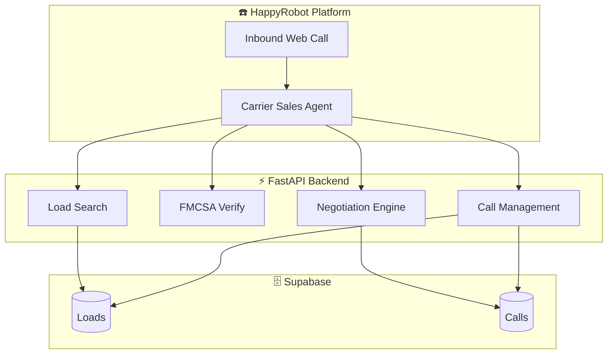

## HappyRobot Workflow

The AI agent workflow handles the complete call lifecycle:

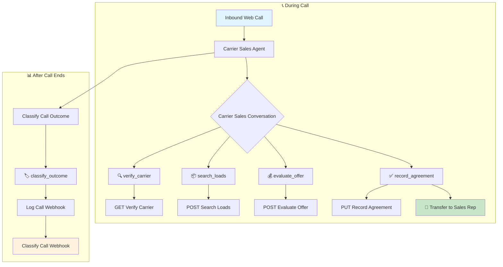

## Tools Available to AI Agent

| Tool | Webhook | Purpose |
|------|---------|---------|
| `verify_carrier` | GET `/carriers/verify/{mc}` | Check if carrier is FMCSA authorized |
| `search_loads` | POST `/loads/search` | Find loads matching carrier's criteria |
| `evaluate_offer` | POST `/negotiations/evaluate` | Check if carrier's price offer is acceptable |
| `record_agreement` | PUT `/calls/{id}/agreement` | Lock in deal, book load, prepare transfer |
| `classify_outcome` | PUT `/calls/{id}/classify` | Tag call with outcome and sentiment |
| `log_call` | POST `/calls/log` | Create/update call record |

## A/B Testing Negotiation Strategies

Since negotiation thresholds are configurable via **HappyRobot workflow variables** (not hardcoded), you can run A/B tests on different pricing strategies without deploying code.

### How It Works

**Negotiation logic:**
- `quoted_price = loadboard_rate × (1 − markup_percentage)` — agent opens low
- Each round, the ceiling rises toward the loadboard rate
- `max_acceptable = loadboard_rate × (1 − round_flexibility)` — goes up each round
- Carrier counters higher, broker stretches up to the loadboard ceiling
- Loadboard rate = absolute ceiling, broker never pays above cost

**Example with loadboard $3,000, markup 15%:**

| | Amount |
|---|---|
| Agent opens at | $2,550 (−15%) |
| Round 1 ceiling (−8%) | $2,760 |
| Round 2 ceiling (−5%) | $2,850 |
| Round 3 ceiling (0%) | $3,000 (loadboard = max) |

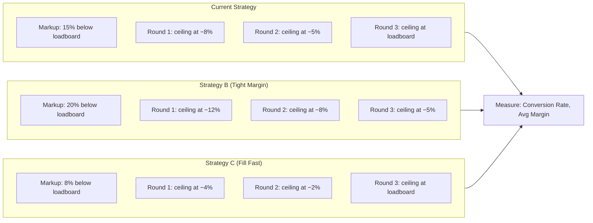

### Setup in HappyRobot

1. **Create multiple workflow versions** (or use environments: staging/production)
2. **Set different variable values** for each version:

| Strategy | markup_percentage | round1_flexibility | round2_flexibility | round3_flexibility | Use Case |
|---|---|---|---|---|---|
| **Current** | 0.15 | 0.08 | 0.05 | 0.00 | Balanced — margin + bookings |
| Tight Margin | 0.20 | 0.12 | 0.08 | 0.05 | Maximize margin, fewer bookings |
| Fill Fast | 0.08 | 0.04 | 0.02 | 0.00 | Fill loads fast, lower margin |

3. **Route traffic** between versions
4. **Compare metrics** in the dashboard:
   - Conversion rate (bookings / calls)
   - Average margin (premium earned %)
   - Negotiation rounds to close

### API Parameters

The `search_loads` endpoint accepts `markup_percentage` and returns `quoted_price` — the agent's opening offer to the carrier (below loadboard):

```json
{
  "origin": "Phoenix",
  "equipment_type": "Dry Van",
  "markup_percentage": 0.15
}
```

Response includes:
```json
{
  "load_id": "LD-2026-0973",
  "loadboard_rate": 3000.00,
  "quoted_price": 2550.00
}
```

The `evaluate_offer` endpoint accepts both `round1_flexibility` and `round1_discount` naming:

```json
{
  "load_id": "LD-2026-0123",
  "carrier_offer": 2800,
  "round_number": 1,
  "markup_percentage": 0.15,
  "round1_flexibility": 0.08,
  "round2_flexibility": 0.05,
  "round3_flexibility": 0.00
}
```

The response includes **all 3 round ceilings, pre-rounded to the nearest $50**, so HappyRobot can store them on round 1 and skip re-querying on rounds 2 and 3:

```json
{
  "is_acceptable": false,
  "quoted_price": 2550.00,
  "min_acceptable_rate": 2750.00,
  "suggested_counter": null,
  "round_number": 1,
  "can_continue": true,
  "round1_max": 2750.00,
  "round2_max": 2850.00,
  "round3_max": 3000.00
}
```

All amounts (`quoted_price`, `round1_max`, `round2_max`, `round3_max`) are rounded to the nearest $50 by the API — the agent always speaks in clean numbers.

**Recommended HappyRobot setup:** Call `evaluate_offer` immediately after pitching the load (no `carrier_offer` needed). Store `quoted_price`, `round1_max`, `round2_max`, `round3_max` as workflow variables. Rounds 1–3 use those stored values — no further API calls needed.

## Data Flow

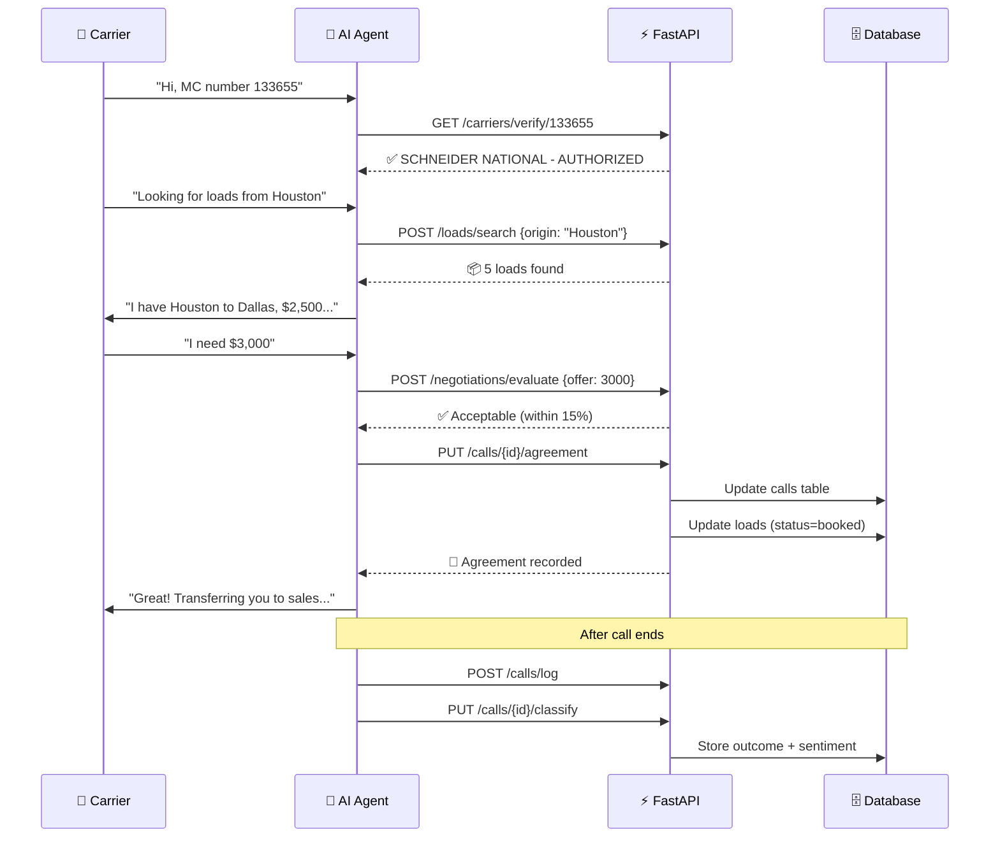

## Database After Successful Deal

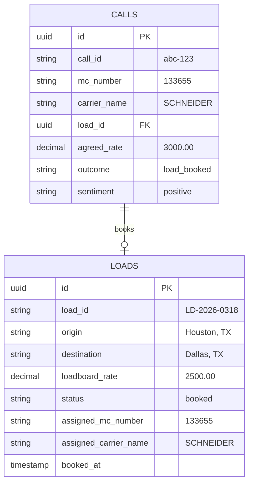

## API Endpoints

### Base URL
**Production:** `https://happyrobot-production-03c4.up.railway.app`

**Dashboard:** `https://happyrobot-production-03c4.up.railway.app/` (same URL, serves dashboard)

### Authentication
All endpoints require header: `X-API-Key: <your-api-key>`

### Endpoints

| Endpoint | Method | Description |
|----------|--------|-------------|
| `/health` | GET | Health check |
| `/carriers/verify/{mc}` | GET | Verify carrier by MC number (live FMCSA lookup) |
| `/loads/search` | POST | Search loads with flexible filters |
| `/loads/{id}` | GET | Get specific load details |
| `/loads/booked` | GET | List all booked loads with carriers |
| `/negotiations/evaluate` | POST | Evaluate carrier counter-offer |
| `/calls/log` | POST | Log/update call record |
| `/calls/{id}/classify` | PUT | Classify call outcome/sentiment |
| `/calls/{id}/agreement` | PUT | Record agreed price + book load |

## Search Features

### Available Filters

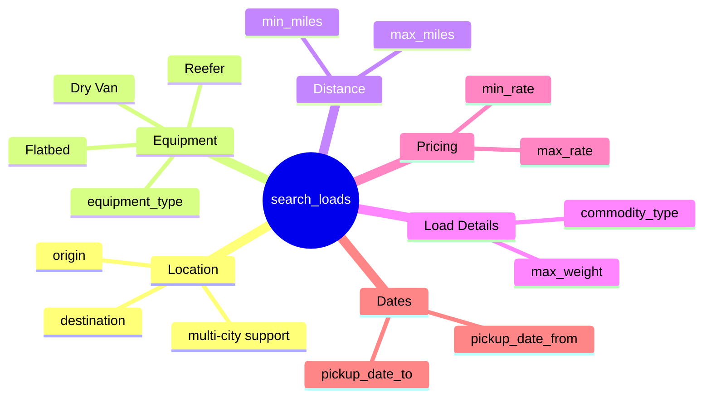

| Parameter | Type | Example | Description |
|-----------|------|---------|-------------|
| `origin` | string | `"Houston"` or `"SF,LA,Phoenix"` | Origin city (supports multiple, comma-separated) |
| `destination` | string | `"Dallas"` or `"NYC,Boston"` | Destination (supports multiple) |
| `equipment_type` | string | `"Dry Van"` | Equipment type |
| `max_miles` | number | `500` | Maximum trip distance |
| `min_miles` | number | `100` | Minimum trip distance |
| `max_weight` | number | `40000` | Maximum load weight |
| `commodity_type` | string | `"produce"` | Commodity type (partial match) |
| `min_rate` | number | `1000` | Minimum rate |
| `max_rate` | number | `5000` | Maximum rate |
| `limit` | number | `10` | Max results (default 10, max 50) |

### Fuzzy City Matching

The search API implements flexible city matching to handle natural conversation:

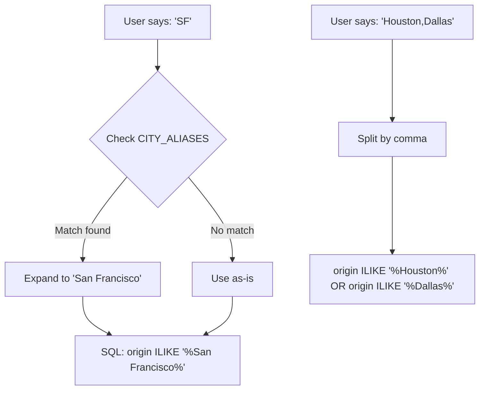

#### Alias Dictionary

| Input | Expands To | Reason |
|-------|------------|--------|
| `SF` | San Francisco | Common abbreviation |
| `LA` | Los Angeles | Common abbreviation |
| `NYC` | New York | Airport code style |
| `DFW` | Dallas | Airport code |
| `ATL` | Atlanta | Airport code |
| `CHI` | Chicago | Common abbreviation |
| `HTX` / `HOU` | Houston | Airport codes |
| `NOLA` | New Orleans | Common nickname |
| `VEGAS` | Las Vegas | Colloquial |
| `PHILLY` | Philadelphia | Nickname |
| `INDY` | Indianapolis | Nickname |
| `BMORE` | Baltimore | Nickname |
| `CALI` | California | State abbreviation |

#### Implementation

```python
CITY_ALIASES = {
    "sf": "San Francisco", "la": "Los Angeles", 
    "nyc": "New York", "dfw": "Dallas", ...
}

def expand_city_alias(city: str) -> str:
    return CITY_ALIASES.get(city.lower().strip(), city)

# In search_loads:
if origin:
    cities = [expand_city_alias(c.strip()) for c in origin.split(",")]
    # Build OR query for each city
```

#### Multi-City Search

Carriers often say "I'm near Houston, Dallas, or Austin" - the API handles this:

```json
{"origin": "Houston,Dallas,Austin", "equipment_type": "Dry Van"}
```

Generates SQL:
```sql
WHERE (origin ILIKE '%Houston%' OR origin ILIKE '%Dallas%' OR origin ILIKE '%Austin%')
  AND equipment_type = 'Dry Van'
  AND status = 'available'
```

### Example Searches

```bash
# Multiple origins (carrier near Houston)
{"origin": "Houston,Dallas,Austin,San Antonio", "equipment_type": "Dry Van"}

# Short haul only
{"origin": "SF", "max_miles": 300}

# Specific commodity
{"commodity_type": "produce", "equipment_type": "Reefer"}

# Rate range
{"min_rate": 2000, "max_rate": 4000, "origin": "CA"}
```

## FMCSA Carrier Verification

### How It Works

Verification is done by **scraping the FMCSA SAFER public website** directly — no API key required. When the agent calls `verify_carrier`, we send an HTTP request to:

```
https://safer.fmcsa.dot.gov/query.asp?searchtype=ANY&query_type=queryCarrierSnapshot&query_param=MC_MX&query_string={mc_number}
```

- `query_param=MC_MX` — tells SAFER to search by Motor Carrier number
- `query_string=123456` — the MC number (we strip any `MC-` prefix automatically)

We parse the HTML response to extract legal name, DOT number, operating status, and authority type.

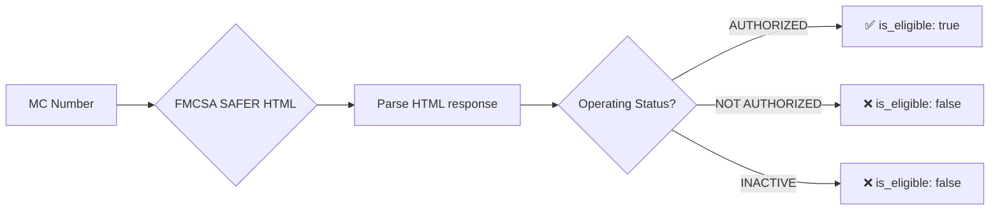

> **Note:** FMCSA blocks direct browser access (403 Forbidden) but allows server-to-server requests. The API works fine from Railway — the browser error is expected.

### Test MC Numbers

| MC Number | Status | Carrier |
|-----------|--------|---------|
| `123456` | ✅ AUTHORIZED | B MARRON LOGISTICS LLC |
| `13446` | ✅ AUTHORIZED | TINO'S TRANSPORTATION LLC |
| `133655` | ✅ AUTHORIZED | SCHNEIDER NATIONAL CARRIERS INC |
| `12345` | ❌ INACTIVE | — |

## Negotiation Logic

The agent quotes carriers a price **below** the loadboard rate, keeping the spread as broker margin. Each negotiation round, the ceiling rises — but never above the loadboard rate (the hard floor for broker cost).

```
quoted_price    = loadboard_rate × (1 − markup_percentage)   ← agent opens here
round_ceiling   = loadboard_rate × (1 − round_flexibility)   ← rises each round
```

The broker earns: `loadboard_rate − agreed_rate`. The carrier never sees the loadboard rate.

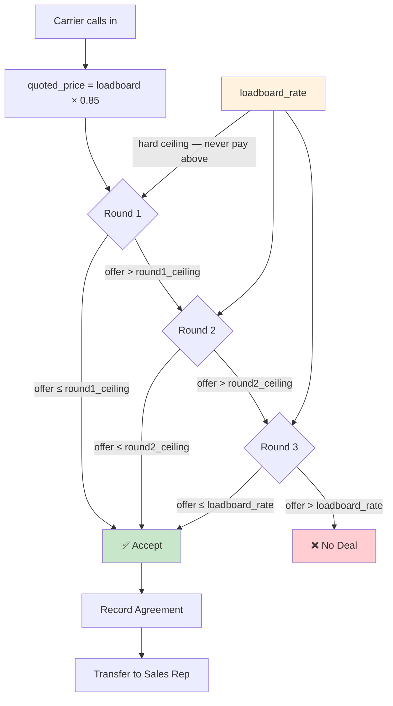

### HappyRobot Workflow Variables

| Variable | Value | Description |
|---|---|---|
| `markup_percentage` | `0.15` | Quote carrier 15% below loadboard rate |
| `round1_flexibility` | `0.08` | Round 1 ceiling: loadboard × (1 − 0.08) |
| `round2_flexibility` | `0.05` | Round 2 ceiling: loadboard × (1 − 0.05) |
| `round3_flexibility` | `0.00` | Round 3 ceiling: loadboard rate (hard max) |

### Example: Loadboard rate $3,000 with current settings

```
quoted_price  = $3,000 × (1 − 0.15) = $2,550   ← agent opens here

Round 1 ceiling = $3,000 × (1 − 0.08) = $2,760  ← accept if carrier asks ≤ $2,760
Round 2 ceiling = $3,000 × (1 − 0.05) = $2,850  ← accept if carrier asks ≤ $2,850
Round 3 ceiling = $3,000 × (1 − 0.00) = $3,000  ← accept up to loadboard rate

All amounts rounded to nearest $50 by the API.
```

Best case: carrier accepts $2,550 (broker earns $450). Worst case: deal closes at $3,000 (broker breaks even). Loadboard rate is never disclosed.

## Database Schema

### Entity Relationship Diagram

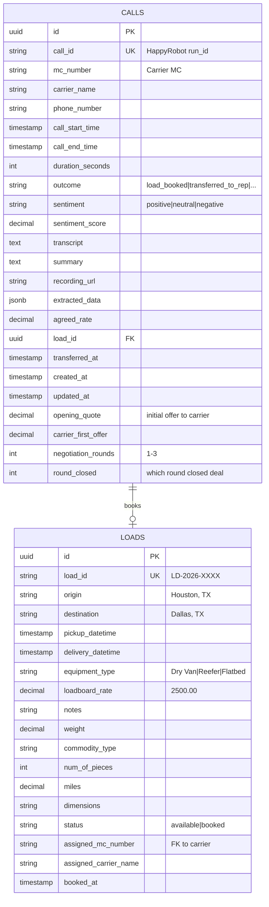

### Tables Summary

| Table | Purpose | Records |
|-------|---------|---------|
| `loads` | Freight loads inventory | 1000+ diverse routes |
| `calls` | Call records with carrier info, outcomes, negotiation tracking | Per call |

### Database Indexes

Indexes optimize the most frequent queries from HappyRobot tools and dashboard:

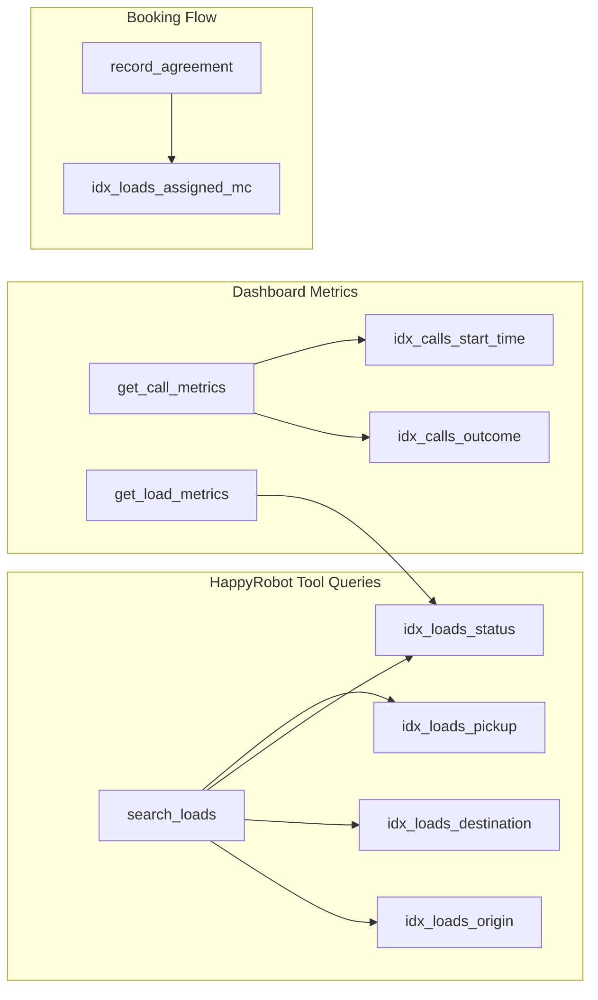

| Index | Table | Column | Used By |
|-------|-------|--------|---------|
| `idx_loads_status` | loads | status | `search_loads`, dashboard metrics |
| `idx_loads_origin` | loads | origin | `search_loads` (WHERE origin ILIKE) |
| `idx_loads_destination` | loads | destination | `search_loads` |
| `idx_loads_pickup` | loads | pickup_datetime | Date range filters |
| `idx_loads_assigned_mc` | loads | assigned_mc_number | Find carrier's booked loads |
| `idx_calls_outcome` | calls | outcome | Outcome distribution metrics |
| `idx_calls_start_time` | calls | call_start_time | "Calls today", time series |

**Note:** With 1000 loads and few calls, indexes have minimal performance impact. They become critical at 100K+ records.

### Call Outcomes
- `load_booked` - Deal closed
- `transferred_to_rep` - Agreed price, transferred to sales rep
- `no_agreement` - Negotiation failed (carrier asked too much)
- `carrier_declined` - Carrier not interested in the load
- `no_matching_loads` - No loads matched carrier's criteria
- `verification_failed` - MC number invalid or carrier not authorized
- `caller_hung_up` - Carrier disconnected before completing flow
- `not_interested` - Carrier declined immediately
- `abandoned` - Call dropped or incomplete

### Sentiment Classification
- `very_positive`, `positive`, `neutral`, `negative`, `very_negative`

## Dashboard & Metrics

The dashboard fetches real-time metrics from PostgreSQL functions for scalability:

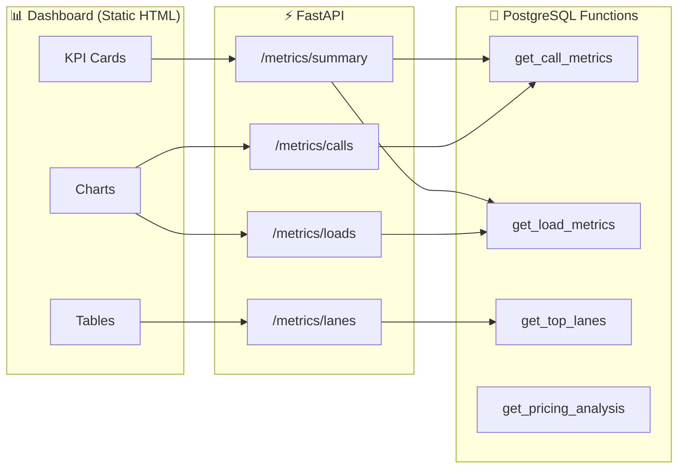

### SQL Aggregation Functions

All metrics computed in PostgreSQL (not in-memory) for scalability:

| Function | Returns | Used For |
|----------|---------|----------|
| `get_call_metrics()` | total_calls, calls_today, outcomes, sentiment | KPI cards, pie charts |
| `get_load_metrics()` | available, booked, equipment_breakdown | Load stats |
| `get_top_lanes(n)` | Top N origin→destination by bookings | Top lanes table |
| `get_pricing_analysis()` | avg_discount_pct, total_agreed_value | Margin analysis |
| `get_negotiation_metrics()` | avg_rounds, round_close_distribution | Negotiation stats (from calls) |

### Margin Analysis

Tracks broker margin across booked deals:

```
Broker Margin % = (loadboard_rate − agreed_rate) / loadboard_rate × 100%
Margin Earned $ = loadboard_rate − agreed_rate  (per deal, summed across all deals)

Example:
  Loadboard rate: $3,000
  Agreed rate:    $2,550  (carrier accepted opening offer)
  Broker margin:  +15% / +$450
```

- **Green (+%)**: We paid the carrier below loadboard — broker keeps the spread
- **Red (−%)**: We paid above loadboard — over market rate (should not happen)

## Environment Variables

| Variable | Description | Required |
|----------|-------------|----------|
| `SUPABASE_URL` | Supabase project URL | Yes |
| `SUPABASE_SERVICE_KEY` | Supabase service role key | Yes |
| `API_KEY` | API authentication key | Yes |

## Deployment

### Live Deployment (Access Now)

| Resource | URL |
|----------|-----|
| **Dashboard** | https://happyrobot-production-03c4.up.railway.app |
| **API Docs (Swagger)** | https://happyrobot-production-03c4.up.railway.app/docs |
| **API Docs (ReDoc)** | https://happyrobot-production-03c4.up.railway.app/redoc |
| **Health Check** | https://happyrobot-production-03c4.up.railway.app/health |
| **Project Overview** | https://miguelpalospou.github.io/happy-robot-challenge/ |
| **GitHub Repo** | https://github.com/miguelpalospou/happy-robot-challenge |

### API Credentials

To test the API, you'll need the following credentials (shared separately via secure channel):

| Credential | Purpose | How to Use |
|------------|---------|------------|
| `API_KEY` | Authenticate API requests | Add header: `X-API-Key: <value>` |
| `SUPABASE_URL` | Database connection (if reproducing locally) | Set in `.env` file |
| `SUPABASE_SERVICE_KEY` | Database access (if reproducing locally) | Set in `.env` file |

**Quick Test (with API key):**

```bash
# Test the API
curl -H "X-API-Key: PROVIDED_KEY" \
  "https://happyrobot-production-03c4.up.railway.app/loads?limit=5"

# Verify a carrier
curl -H "X-API-Key: PROVIDED_KEY" \
  "https://happyrobot-production-03c4.up.railway.app/carriers/verify/1234567"
```

**Note:** The Dashboard at the root URL works without authentication for demo purposes.

### Reproduce Deployment (Railway)

**Prerequisites:**
- [Railway CLI](https://docs.railway.app/develop/cli) installed
- Railway account (free tier available)
- Supabase project with schema deployed

**Step-by-step:**

```bash
# 1. Clone the repository
git clone https://github.com/miguelpalospou/happy-robot-challenge.git
cd happy-robot-challenge

# 2. Login to Railway
railway login

# 3. Create a new project (or link to existing)
railway init
# Select "Empty Project" when prompted

# 4. Set environment variables
railway variables set SUPABASE_URL="https://your-project.supabase.co"
railway variables set SUPABASE_SERVICE_KEY="your-service-key"
railway variables set API_KEY="your-secure-api-key"

# 5. Deploy
railway up

# 6. Generate public domain
railway domain
# Returns: https://your-app-production-xxxx.up.railway.app
```

### Database (Supabase)

The database is hosted on Supabase. To access or reproduce:

**Option 1: Use Existing Database (Shared Access)**

Contact the project owner for read-only credentials or request access via Supabase Dashboard sharing.

**Option 2: Create Your Own Supabase Project**

1. Create a free project at [supabase.com](https://supabase.com)
2. Go to SQL Editor and run migrations in order:

```bash
# Run migrations in order via Supabase SQL Editor
001_initial_schema.sql       # Core tables: loads, calls
002_add_indexes.sql          # Performance indexes
003_generated_loads.sql      # Seed 1000+ loads
004_add_carrier_to_loads.sql # Carrier assignment columns
005_metrics_functions.sql    # PostgreSQL aggregation functions
006_flatten_negotiations.sql # Adds negotiation tracking to calls table
```

> Run each file in the Supabase Dashboard → SQL Editor. Direct `psql` connections may be blocked depending on network.

Or via Supabase Dashboard: SQL Editor → paste each migration file.

## Local Development

### Option 1: Docker (Recommended)

```bash
# 1. Copy environment file and add your credentials
cp .env.example .env

# 2. Run with Docker Compose
docker-compose up --build

# Or manually with Docker
docker build -t happy-robot-api .
docker run -p 8000:8000 --env-file .env happy-robot-api
```

### Option 2: Direct Python

```bash
cd api
pip install -r requirements.txt
cp ../.env.example .env  # fills credentials into api/.env — where the app looks
uvicorn main:app --reload --port 8000
```

### Access Points

| URL | Description |
|-----|-------------|
| http://localhost:8000 | Dashboard |
| http://localhost:8000/docs | API Documentation (Swagger) |
| http://localhost:8000/redoc | API Documentation (ReDoc) |
| http://localhost:8000/health | Health Check |

## Security

### HTTPS / TLS

| Environment | Implementation |
|-------------|----------------|
| **Production** | Railway provides automatic SSL/TLS via Let's Encrypt |
| **Local** | HTTP (self-signed acceptable per requirements) |

Production URL: `https://happyrobot-production-03c4.up.railway.app`

### API Key Authentication

All API endpoints require authentication via the `X-API-Key` header.

```python
# main.py - Security middleware
api_key_header = APIKeyHeader(name="X-API-Key", auto_error=False)

async def verify_api_key(api_key: str = Security(api_key_header)):
    if not api_key or api_key != settings.api_key:
        raise HTTPException(status_code=401, detail="Invalid or missing API key")
    return api_key

# Applied to all routers
app.include_router(loads.router, dependencies=[Depends(verify_api_key)])
app.include_router(carriers.router, dependencies=[Depends(verify_api_key)])
app.include_router(negotiations.router, dependencies=[Depends(verify_api_key)])
app.include_router(calls.router, dependencies=[Depends(verify_api_key)])
app.include_router(metrics.router, dependencies=[Depends(verify_api_key)])
```

**Usage:**

```bash
# All API calls require the X-API-Key header
curl -H "X-API-Key: your-api-key" https://happyrobot-production-03c4.up.railway.app/loads

# Unauthorized requests return 401
curl https://happyrobot-production-03c4.up.railway.app/loads
# {"detail": "Invalid or missing API key"}
```

**Configuration:**

Set the API key in your `.env` file:

```
API_KEY=your-secure-api-key-here
```

### Environment Variables

| Variable | Required | Description |
|----------|----------|-------------|
| `SUPABASE_URL` | Yes | Supabase project URL |
| `SUPABASE_SERVICE_KEY` | Yes | Supabase service role key (not anon key) |
| `API_KEY` | Yes | API authentication key for webhooks |
| `DEBUG` | No | Enable debug mode (default: false) |
| `LOG_LEVEL` | No | Logging level (default: INFO) |

## Agent Northstars (Behavioral Guidelines)

These rules are configured in HappyRobot UI as evaluators to monitor agent behavior:

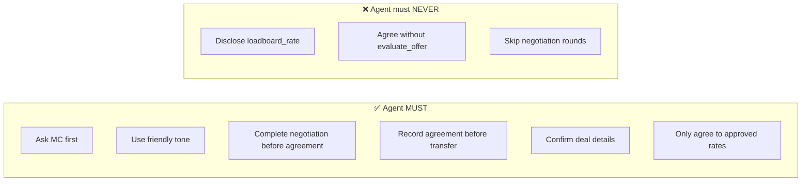

| # | Northstar | Description |
|---|-----------|-------------|
| 1 | **Ask for MC Number** | At call start, request MC number to verify carrier |
| 2 | **Friendly Professional Tone** | Greet warmly, speak professionally |
| 3 | **Negotiation Before Agreement** | Complete all rounds before recording agreement |
| 4 | **Agreement Before Transfer** | Call `record_agreement` before transferring to sales |
| 5 | **Rate Confidentiality** | **NEVER** disclose `loadboard_rate` to carrier |
| 6 | **Agreed Price Transfer** | When accepted, confirm details and transfer |
| 7 | **Agreed Rate Within Range** | Only agree to rates approved by `evaluate_offer` |

## Tech Stack

- **Backend:** FastAPI (Python)
- **Database:** Supabase (PostgreSQL)
- **Deployment:** Railway (Docker)
- **Carrier Verification:** FMCSA SAFER (live lookup)
- **AI Platform:** HappyRobot

## License

MIT
